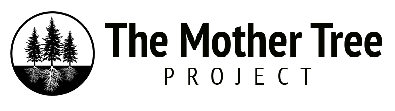

<!-- README.md is generated from README.Rmd. Please edit that file -->

# Forest Biomass Package

<!-- badges: start -->

<!-- badges: end -->

Description: A package developed to convert field data to forest biomass

Principal Author: Thomson Harris

Email - <thomsonharris@gmail.com>,

Phone - 778-866-4198

# Purpose:

# Keywords:

Forestry, Silviculture, Ecology, Climatic Distance, Assisted Migration,
Climate Change
