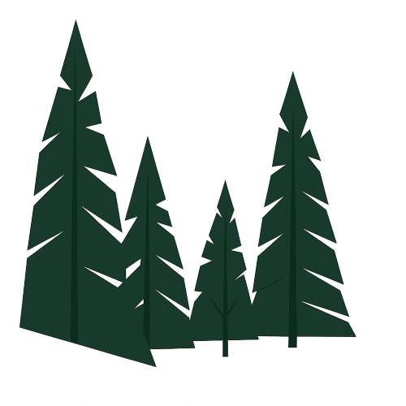

<!-- README.md is generated from README.Rmd. Please edit that file -->

# Forest Biomass Package

<!-- badges: start -->

<!-- badges: end -->

Description: A package developed to convert field data to forest biomass

Principal Author: Thomson Harris - <thomsonharris@gmail.com>

## Release State:

This package is under current development and changes are expected
rapidly.

## Current Uses:

### Tree Biomass

Supported:

- Woody stem

- Foliage

- Bark

- Branches

Undeveloped:

- Roots

## Future Uses:

### 

### 

### 
